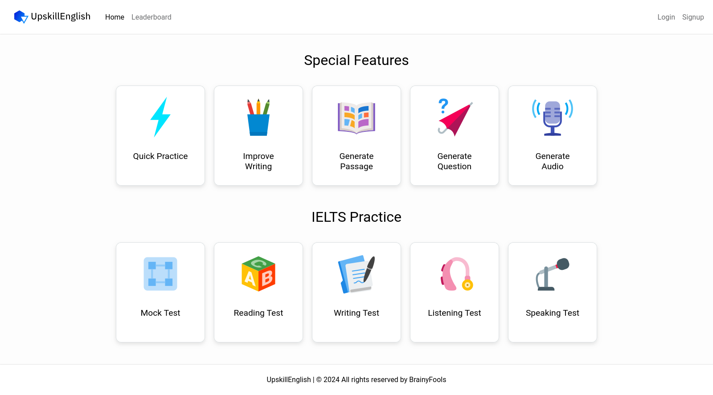
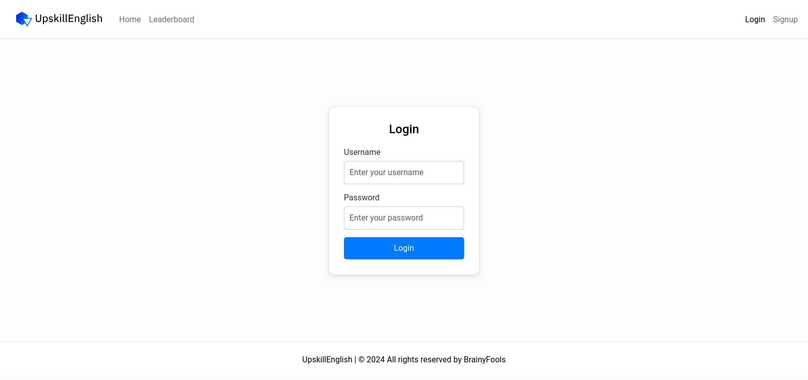
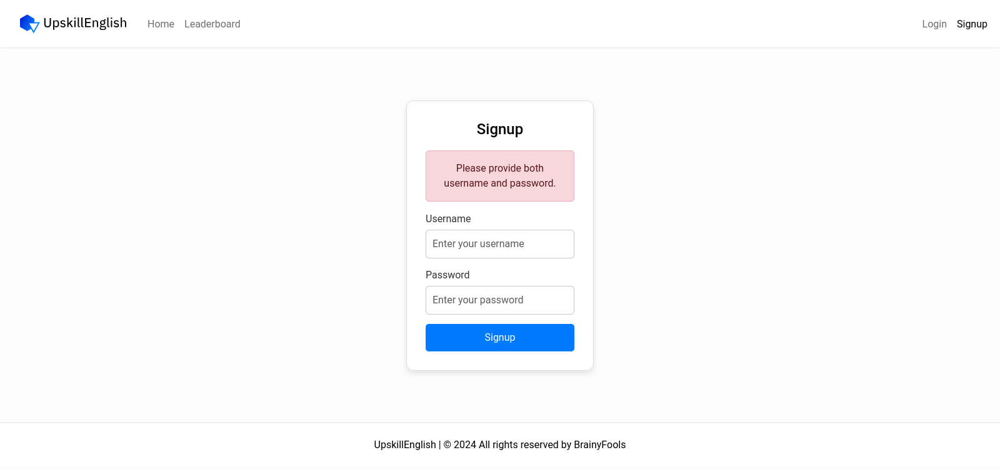
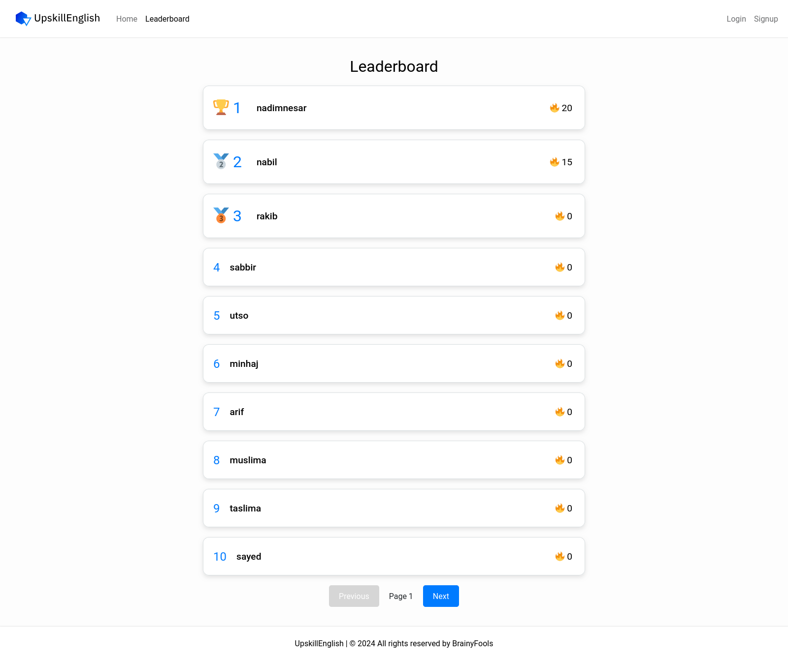
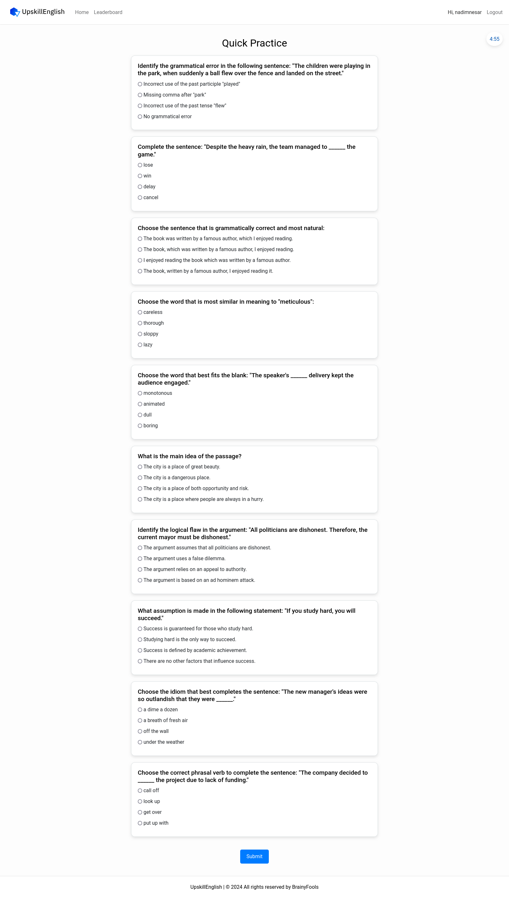
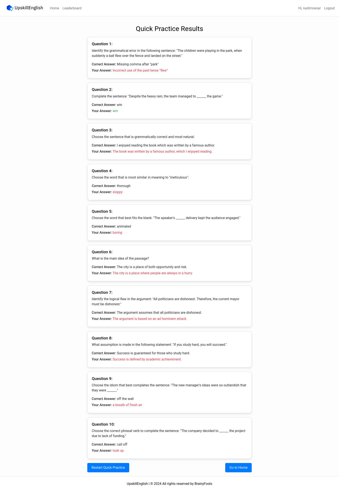
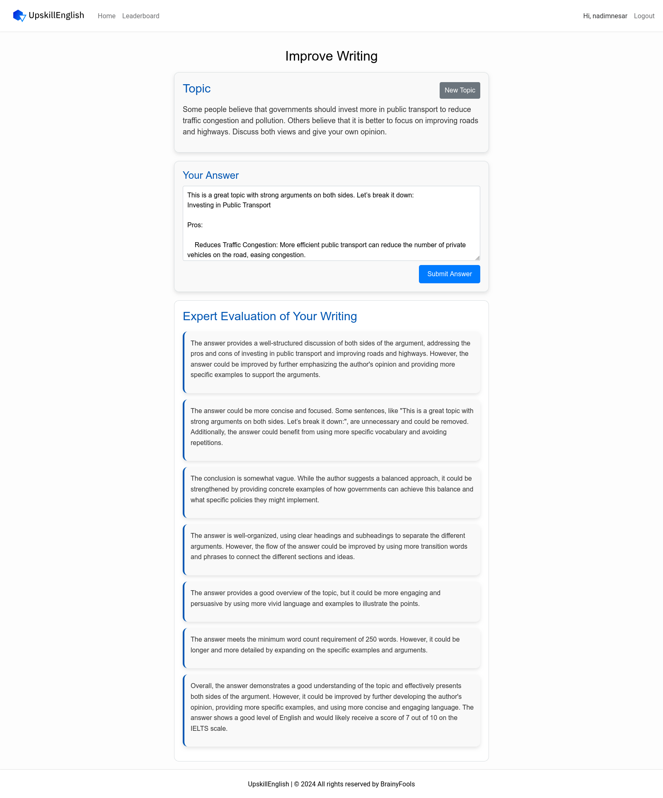
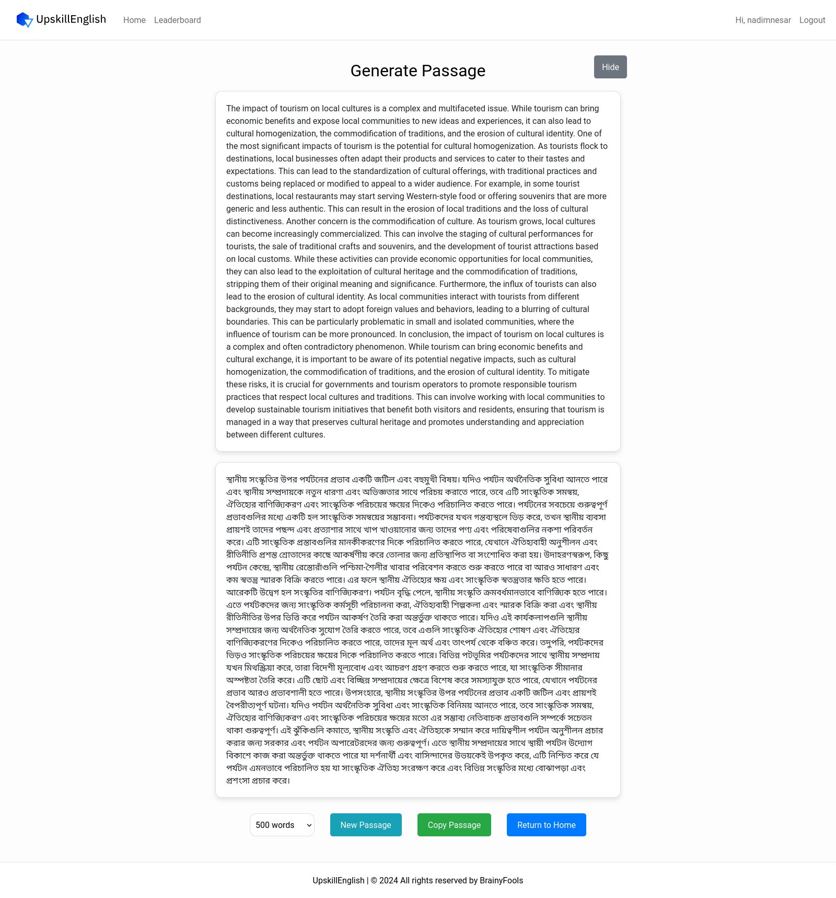

# UpskillEnglish

UpskillEnglish is a web application designed to enhance English proficiency through two focused sections: **Practice Zone** and **Assessment Zone**. Whether you're looking to hone your skills or evaluate your progress, UpskillEnglish offers a comprehensive solution for advanced English learners.

## Features

### 1. Practice Zone
The Practice Zone is designed to help users improve their English through various interactive tools. Key features include:

- **Passage Learning Lab:** Users can access new academic-level passages, with translation options to aid comprehension.
- **Question Practicing Hub:** Generate four types of reading-related questions by inputting a passage, helping users engage with diverse question formats.
- **Improve Writing:** Submit written responses on specific topics and receive detailed corrections and feedback to refine writing skills.
- **Improve Listening:** Play audio clips to practice listening, with text and translation support to reinforce understanding.

### 2. Assessment Zone
The Assessment Zone allows users to test their English proficiency through a structured and rigorous evaluation process. This section provides instant feedback and detailed scoring:

- **Quick Practice:** Focused on testing core language skills such as grammar, sentence completion, synonyms, antonyms, word usage, vocabulary, coherence, cohesion, and idioms. Immediate correction is provided after submission.
- **Reading Test:** A two-part reading test designed to assess key reading abilities. 
  - **Part 1:** Evaluates fact-checking and text cohesion.
  - **Part 2:** Focuses on paragraph matching and understanding.
- **Writing Test:** Two sections that assess written communication skills.
  - **Part 1:** Graph analysis and interpretation.
  - **Part 2:** Essay writing on a given topic.
- **Listening Test:** Users listen to an audio clip and answer various question types to assess their listening skills.

Each of the assessment features provides a score upon test completion, and a **Leaderboard** feature displays user rankings based on their performance.

## How It Works
1. Choose between the **Practice Zone** to improve your skills or the **Assessment Zone** to evaluate your progress.
2. Engage with the content, practice regularly, and track your scores on the leaderboard.
3. Benefit from instant feedback, detailed insights, and personalized corrections.

UpskillEnglish is your ultimate companion for mastering advanced English and preparing for exams like IELTS and TOEFL.

Frontend URL: https://github.com/nadimnesar/upskillenglish-frontend
 
Swagger URL: http://localhost:8080/swagger-ui/index.html#/

## Screenshots

### Home Page

### Login Page

### Signup Page

### Leaderboard Page

### Quick Test Page

### Quick Test Result Page

### Improve Writing Page

### Generate Passage Page

